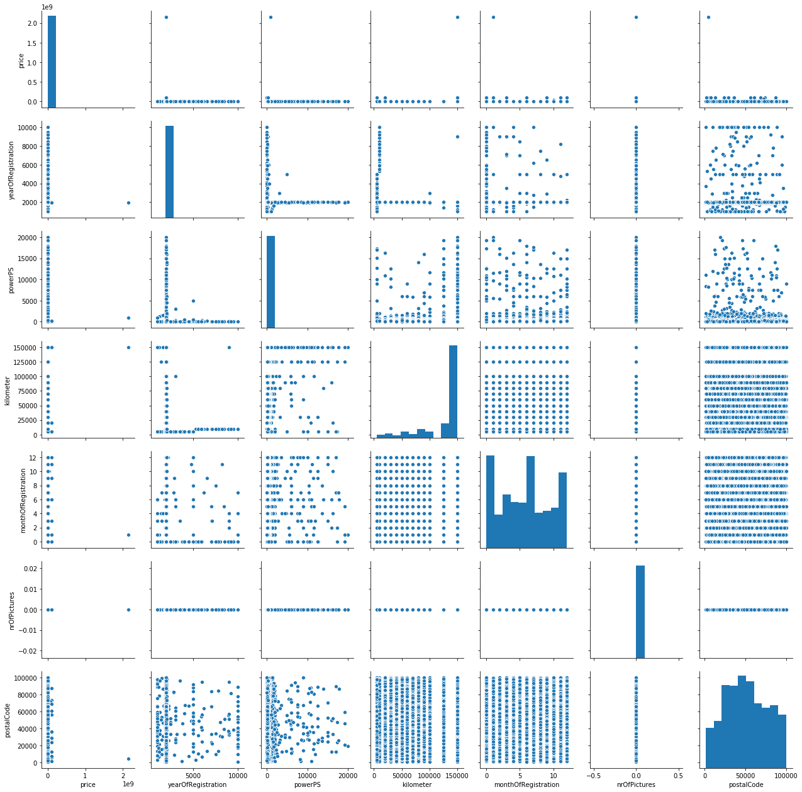
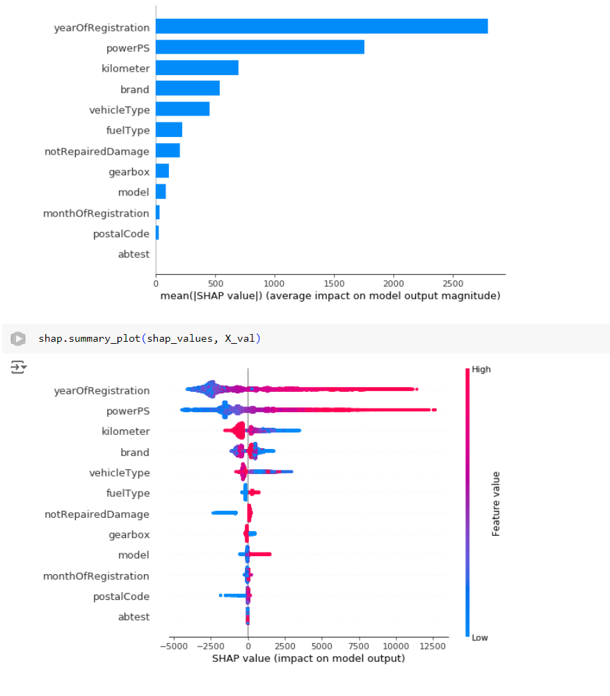

# Auto Value Predictor

## Overview
The main objective of this project is to build a machine learning model that can predict the price of a car based on its features such as make, model, year of manufacture, mileage, engine size, and other relevant attributes.

## Introduction
This project aims to assist users in estimating the value of their cars using a data-driven approach. By analyzing various features of a car, such as its make, model, year, mileage, engine size, fuel type, and transmission, the model provides an accurate prediction of the car's price.

## Dataset
The dataset used for this project is sourced from Kaggle and contains a variety of features related to car specifications and their respective prices. The key attributes in the dataset include:
- **Make**: The brand of the car (e.g., Toyota, BMW).
- **Model**: The specific model of the car.
- **Year**: The year the car was manufactured.
- **Mileage**: The total distance the car has traveled.
- **Engine Size**: The size of the car’s engine.
- **Fuel Type**: The type of fuel the car uses (e.g., petrol, diesel).
- **Transmission**: The type of transmission (e.g., manual, automatic).
- **Price**: The price of the car (target variable).

## Objective
The goal is to develop a machine learning model that can accurately predict car prices based on the features mentioned above. This can help potential car buyers and sellers make informed decisions.

## Conclusion
The developed model aims to provide a robust solution for predicting car prices. By leveraging various car features, the model can offer accurate price estimates, thereby aiding in better decision-making for car buyers and sellers.

## Acknowledgements
Special thanks to Kaggle for providing the dataset and to all contributors and supporters of this project.

For more information, please visit the project's [GitHub repository](https://github.com/yourusername/Auto_value_predictor).

### Graphics

